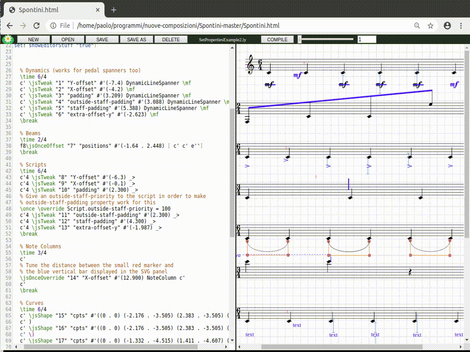
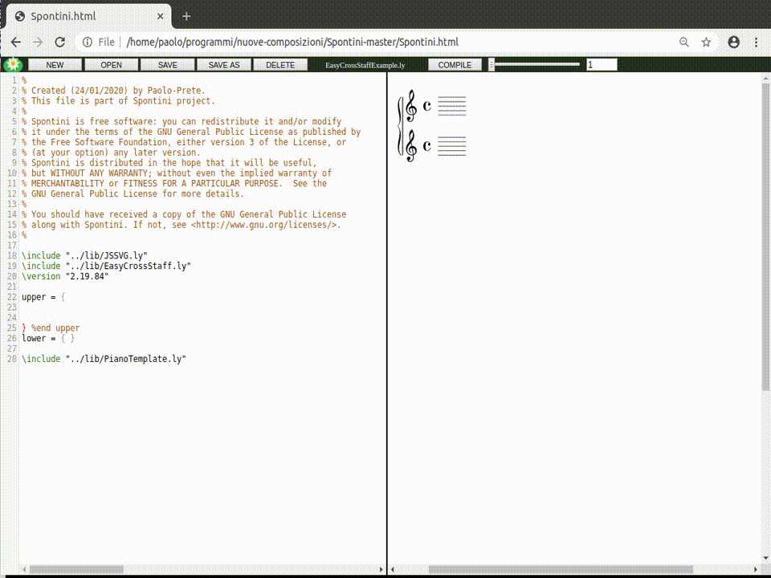

# SPONTINI (FKA *"LilyJSSVG"*)

Spontini (FKA "LilyJSSVG") is a text-combined-with-graphic music editor that strongly speeds up the creation and fine graphic tuning of complex scores edited with **[Lilypond](https://lilypond.org/)** through two main features:

  * It allows the positioning of musical objects (articulations, texts, pedals, curves, brackets etc.) with the mouse, both for "avoid-collisions" properties (X/Y-offset, staff-padding, outside-staff-padding, padding) and for extra-offset property. Once the positioning is graphically done, the text editor reports the corresponding changes on the input file: these changes are written in standard Lilypond code and do not require any additional software to be compiled.

  * It assists in the creation of piano music by inserting notes in tabular and formatted form. It also supports cross-staff scores through a set of work-arounds (invisible to the user) that solve many issues of the native cross-staff functions.

Spontini is written in Javascript; it is portable on all Desktop operating systems and is compatible (and tested) with the Firefox and Chrome (Chromium) browsers.

Spontini's text editor component uses **[Codemirror](https://codemirror.net/)** library, which it will automatically download from the [cloud](https://cdnjs.cloudflare.com)

## INSTALLATION

Just install:

  * **[Lilypond 2.19.84](http://lilypond.org/download.html)** (it may also work on some previous 2.19.x versions, but has not been tested for them).

  * **[Python 3.x](https://www.python.org/downloads/)**

*Note for **Linux** users*: make sure that Tkinter support for Python 3 is also installed (on Ubuntu: sudo apt-get install python3-tk).

*Note for **Windows** users*: make sure that the "Path" variable is set, both for Lilypond and for Python 3, as explained on [this](https://lilypond.org/windows.html) page.

*Note if you use **Firefox** browser*: visit "about:config" page and set "dom.dialog_element.enabled" preference to "true".
<br/>
## RUNNING LOCALLY

  * Run **SpontiniCompileHelper.py**, choose a workspace directory (the place where input and output lilypond files will be placed) and press "Start". If you choose the "examples" directory included in the project, the examples referenced by the following documentation can be tested

  * Open the file **Spontini.html** with your browser. The editor will appear and it will allow to edit and compile files in the chosen workspace.

  * You can check the Lilypond compiling output on the Javascript console of your browser (open "Web developer" ---> "Web console" on Firefox and "More tools" ---> "Developer tools" on Chrome/Chromium)<br/>

## BASIC DOCUMENTATION

### 1) Tweaking/Overriding a music property




Spontini maps Lilypond's **\once \override** and **\tweak** commands, used on object positioning properties (**extra-offset**, **Y-offset** etc.), with two respective commands: **\jsOnceOverride** and **\jsTweak**. The result of these commands can be modified using the mouse, acting on the generated SVG drawing, in order to avoid Lilypond's standard trial-and-error process.

For example, if we want to modify the extra-offset of a dynamic, the standard Lilypond code will be:

```
{
    % Lilypond standard
    %
    % Tweak
    c' c' \tweak extra-offset #'(0.71 . -3.539) \mf c' c'
    % Override
    c' \once \override DynamicText.extra-offset = #'(1.806 . -2.388) c'\mf c' c'
}
```
The above code, translated into the respective Spontini commands, becomes:

```
\include "path/to/lib/JSSVG.ly"

{
    % Spontini's map
    %
    % Tweak
    c' c' \jsTweak "ID1" "extra-offset" #'(0.71 . -3.539) \mf c' c'
    % Override
    c' \jsOnceOverride "ID2" "extra-offset" #'(1.806 . -2.388) DynamicText c'\mf c' c'
}
```

Where "ID1/2" are unique numbers associated with each of the properties to be modified. The **\jsTweak** and **\jsOnceOverride** commands (and, consequently, the unique IDs) can be automatically generated in two ways:

 1. By clicking on the corresponding dynamic in the right display panel of the score with the right mouse button; a drop-down menu will open: it allows you to choose the property to be tweaked.

 2. By pressing **Ctrl-F1** (\jsTweak) and **Ctrl-F2** (\jsOnceOverride) keys. A string in the form **\jsTweak(Override) "ID" " " # '()** will be generated by the editor; in this string, the property to be modified must be entered manually.

Once the Spontini commands have been created, and after compiling the file, the corresponding objects will be highlighted by the editor and you can edit them with the mouse.

Try **[THIS](examples/SetPropertiesExample1.ly)** and **[THIS](examples/SetPropertiesExample2.ly)** example to better understand.

*NOTE 1*: For beam and curves (Slur, PhrasingSlur and Tie) the respective commands to be used are **\jsOnceOffset** and **\jsShape**, available in the drop-down menu, which map respectively **\once \offset** and **\shape** commands.

*NOTE 2*: For a (non-exhaustive) list of the properties supported by Spontini for the various objects, refer to **[THIS](examples/SetPropertiesExample2.ly)** and **[THIS](examples/PaddingOnBracketsExample.ly)** examples (being updated).

### <br/>2) Easy Cross-Staff



The **\easyCrossStaff** function is particularly useful for creating piano scores; it allows you to insert the notes of both staves of the piano part into a table that is automatically formatted during insertion.

By pressing **Ctrl-2** keys, the following object will be inserted in the text editor, which defines the above table:

```
\easyCrossStaff %TMODE
  { s \CS }
  { s \CS }
#'( - \CS )
```

The **\CS** marker separates the columns of the table. Press **Ctrl-3** keys to add a column to the table. To delete a column, use the block-selection mode by holding down the **Alt** key and selecting the column with the mouse.

The first row of the table defines the notes of the upper staff, the second row the notes of the lower staff. The last line defines the position of the cross-staff beams:

  * The 'U' character places the cross-staff beams at the top
  * The 'D' character places the cross-staff beams at the bottom
  * The 'C' character places the cross-staff beams between the staves
  * The 'N' character disables cross-staff
  * The '-' character maintains the behavior of the previous character

Look at **[THIS](examples/EasyCrossStaffExample.ly)** and **[THIS](examples/EasyCrossStaffExample2.ly)** example to understand better

**IMPORTANT!** in order to use EasyCrossStaff, not only must the EasyCrossStaff.ly file be included; the following piano template must also be used, and the tables must be inserted in the upper staff:

```
\include "path/to/lib/JSSVG.ly"
\include "path/to/lib/EasyCrossStaff.ly"

upper = {
   % insert cross-staff tables here!
}

lower = { }

\include "path/to/lib/PianoTemplate.ly"
```

Note: if you want to avoid automatic formatting, remove the string "% TMODE"

The cross-staff table can also be inserted using **Ctrl-1** keys. In this case it will appear in the following form:

```
%%% __LAYOUT__ %%%

%%%%%%%%%%%%%%%%%%

\easyCrossStaff %TMODE
  { s \CS }
  { s \CS }
#'( - \CS )
```

The block of text above the table allows you to automatically create and insert layout variables, grouping table objects, so to prevent the table from becoming too long horizontally and so to have a clearer view of the score from the text. To create a layout variable, select with the mouse a part of the text of the table, for example the group of objects **\sustainOn\mf_"espressivo"** (and \sustainOff) as in the following code

```
%%% __LAYOUT__ %%%

%%%%%%%%%%%%%%%%%%

\easyCrossStaff %TMODE
  { c'4                           \CS s            \CS }
  { c'4\sustainOn\mf_"espressivo" \CS r\sustainOff \CS }
#'( D                             \CS -            \CS )
```

... and press **Ctrl-5** keys, while keeping the previous text selected. A layout variable will be added in the upper block, and it will shorten the table's code:

```
%%% __LAYOUT__ %%%

#(define l2 #{
\sustainOff
#})

#(define l1 #{
\sustainOn\mf_"espressivo"
#})

%%%%%%%%%%%%%%%%%%

\easyCrossStaff %TMODE
  { c'4    \CS s    \CS }
  { c'4$l1 \CS r$l2 \CS }
#'( D      \CS -    \CS )
```

### <br/>3) Outside-Staff-Ordered (OSO) Padding


In addition to the standard Lilypond avoid-collision positioning properties (X/Y-offset, padding, staff-padding and outside-staff-padding) Spontini supports vertical and horizontal padding done with boxed barriers around graphic objects. These boxes, made with the **\jsOSOPadder** command, can be edited using the mouse. They also allow you to vertically sort the enclosed objects.

For example, if we have a note with a dynamic, a text markup and an articulation:

```
{
  c'\mf_"text"_>
}
```

... we can decide to sort the three objects in the following ways (from top to bottom):

 1. ---> 1) articulation 2) dynamic 3) text
 2. ---> 1) text 2) articulation 3) dynamic

In both cases just write the objects in the desired order (left to right == top to bottom for objects below the staff, and bottom to top for objects above the staff), and add to each of them the respective jsOSOPadder object:

```
\include "path/to/lib/JSSVG.ly"
\include "path/to/lib/OSOPadding.ly"

{
  \resetOSPositions
  % 1) articulation 2) dynamic 3) text
  c' \jsOSOPadder "1" "pads" #'() _\mf \jsOSOPadder "2" "pads" #'() _> \jsOSOPadder "3" "pads" #'() _"text"
}
```

```
\include "path/to/lib/JSSVG.ly"
\include "path/to/lib/OSOPadding.ly"

{
  \resetOSPositions
  % 1) text 2) articulation 3) dynamic
  c' \jsOSOPadder "6" "pads" #'() _"text" \jsOSOPadder "4" "pads" #'() _> \jsOSOPadder "5" "pads" #'() _\mf
}
```

Once the code has been compiled, not only will the three objects be ordered as desired: a rectangular barrier will be added to them. The dimensions of this barrier can be modified with the mouse, which will consequently modify the padding of the enclosed objects.

You can add a jsOSOPadder in two ways:

 1. By clicking on the corresponding object, in the SVG panel, with the right mouse button, and choosing the "OSOPadder" item
 2. By pressing **Ctrl-4** keys in the text panel

Try **[THIS](examples/OSOPaddingExample.ly)** and **[THIS](examples/OSOPaddingExample2.ly)** example to better understand.
Look at **[THIS](examples/EasyCrossStaffExample3.ly)** example as well, in order to see how OSOPadding can be used together with EasyCrossStaff.

Thanks to [Aaron Hill](https://github.com/seraku24) and Thomas Morley for the support in doing this!
