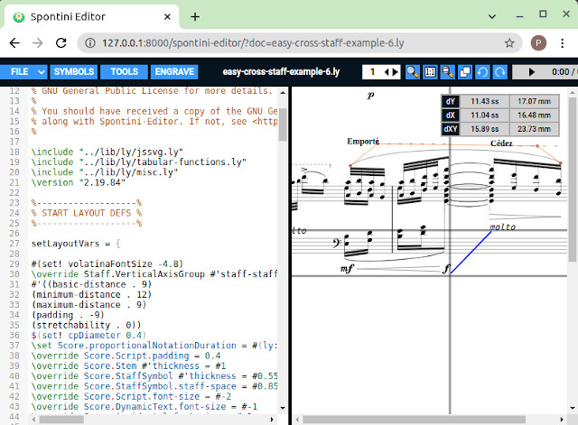

<!--
Created (20/11/2020) by Paolo-Prete.
This file is part of Spontini-Editor project.

Spontini-Editor is free software: you can redistribute it and/or modify
it under the terms of the GNU General Public License as published by
the Free Software Foundation, either version 3 of the License, or
(at your option) any later version.
Spontini-Editor is distributed in the hope that it will be useful,
but WITHOUT ANY WARRANTY; without even the implied warranty of
MERCHANTABILITY or FITNESS FOR A PARTICULAR PURPOSE.  See the
GNU General Public License for more details.

You should have received a copy of the GNU General Public License
along with Spontini-Editor. If not, see <http://www.gnu.org/licenses/>.
-->

# Miscellaneous
<br></br>

### AXES

Once a score is loaded and rendered, four draggable axes, useful for graphically aligning objects, can be activated by selecting "TOOLS--->Toggle axes"

### COMPILE CHUNKS OF SCORE

When editing a portion of a long score without compiling it, it is easy to make typos or syntax errors. We do not always manage to correct these errors on the first attempt, even if we know where the error is located, and this can mean that the overall time it takes to compile the first two incorrect attempts is long. If the attempts are N, the time taken to correct the error will be:

Tscore * N

Where Tscore is the time taken to compile the entire score (or an entire section). To reduce this time considerably, you can use the "Compile selected chunk" tool, which allows you to compile on the fly, without generating the output, any small (or big) piece of code where we know the error is located.
This way, once the chunk has been fixed and compiled correctly, we can compile the entire score (or section).
See how the tool works in **[THIS](../examples/chunks-example.ly)** example.
You can also add a filter for sections or pages of the score. See how it works in **[THIS](../examples/filter-example-1.ly)**,  **[THIS](../examples/filter-example-2.ly)** and **[THIS](../examples/filter-example-3.ly)** examples.

### DOCK / UNDOCK SCORE BUTTON

... Don't forget to allow popups from Spontini-Editor's URL in your browser: then you can undock/dock the score into/from a separated window by pressing this button.

### EXTRACTING SCORE PARTS

With the following tools:

  * Make all &#95;&#95;BLOCK&#95;&#95;s included
  * Make all &#95;&#95;BLOCK&#95;&#95;s inline
  * Make &#95;&#95;BLOCK&#95;&#95; included
  * Make &#95;&#95;BLOCK&#95;&#95; inline

... parts of the score can be automatically extracted as separate files, or put inline into the main ly file, as **[THIS](../examples/string-quartet-template-example.ly)** example shows.
  
### FORK MODE

By choosing ***FILE ---> FORK***, you can create a copy of the current document, with a random generated name, and make it automatically available on the www for collaborative editing (just copy and share the generated link).

You can run the web-server in **"fork-access-only"** mode as well, which is an option included in **[saved-config.txt](../lib/saved-config.txt)**: if set to **"yes"**, the **"OPEN"** and **"DELETE"** options of the menu will be disabled, so that the forked files won't be seen/deleted by users connected to the same web server's host.

### GENERATE PDF

There are two ways to create a PDF from the edited score:

  1) Compile the score while in PDF mode then choose FILE ---> DOWNLOAD PDF
  2) Compile the score while in SVG mode then choose FILE ---> EXPORT SVG TO PDF

Option 2) is automatically enabled if **[Inkscape](https://inkscape.org/)** is currently installed. If it is not installed in the default installation directory, you have to manually set the path of the executable in the 'inkscape-exec' parameter of the **[saved-config.txt](../lib/saved-config.txt)** file.

The generated PDF file can be further modified through a script that is executed by SpontiniServer. Check **[THIS](../examples/pdf-manipulate-example.ly)** example to see how to add objects (like strings, vector or raster images and others) to the generated page (a little bit of Python knowledge is required).

### MIDI INPUT

Single notes and chords can be inserted with a MIDI device by enabling MIDI input with "TOOLS ---> Set MIDI input channel". If you want to make the MIDI input channel permanent, so to automatically enable it when the editor is loaded, you can set the "default-midi-input-channel" parameter (set it to -1 if you want to disable it).
All the notes will be written in the language set in the very first line of the score, with the \language  "language_name" command. When inserting midi notes/chords into a piano table, they will be automatically placed in the upper staff; you can swap them from the upper to the lower staff, or viceversa, by selecting them with the mouse (or by placing the cursor inside them) and then pressing **Ctrl + Arrow UP/DOWN** keys.


Accidentals are written as sharp: you can swap them to flat (or from flat to sharp) by selecting the corresponding notes with the mouse (or by placing the cursor inside them) and then pressing **Ctrl + b** keys.
The MIDI input feature uses Web MIDI API, and it works natively on Chrome. On Firefox, Web MIDI API is not supported natively, but there are some addons for enabling it, like **this one[https://addons.mozilla.org/en-US/firefox/addon/web-midi-api/]**.
On Windows, and probably on macOS too, a running virtual loopback MIDI program is required too, in order to make Web MIDI API work. There are some free programs for creating a virtual MIDI cable: just pick and run one of them, then visit **THIS[https://www.onlinemusictools.com/webmiditest/]** page, for example, for checking if the MIDI input works correctly on your browser.

### MIDI VLC PLUGIN

This plugin can be launched on the web server's host. You can enable it by setting the **&lt;enabled&gt;** tag to **"true"**, inside **[plugins.xml](../plugins/plugins.xml)** and installing **[VLC](https://www.videolan.org/vlc/index.html)** with MIDI support. Check **[https://wiki.videolan.org/Midi/](https://wiki.videolan.org/Midi)** for more infos.

A minimal skin, which is good for a MIDI player (it doesn't show the default video panel) is included into the plugins directory (mpui.vlt): you can set it by following **[THESE](https://www.videolan.org/vlc/skins.html)** instructions.

### MOBILE DEVICES

If, for some reasons, you use a mouse with your mobile device but the right button doesn't work, try to launch the client with the following URL:

```
http://localhost:8000/spontini-editor?mobilemode=yes
```

Then the svg drop-down menu is displayed after a double click on the left mouse button.

### OUTPUT

You can check the LilyPond compiling output in two ways:

  * On the Javascript console of your browser (open "Web developer" ---> "Web console" on Firefox and "More tools" ---> "Developer tools" on Chrome/Chromium).
  * On the Spontini-Server's window or on the Spontini-Server's output (if the server is launched with "nogui" option)
  
### PAN-ZOOM

You can activate it by pressing the len button on the menu, or by keeping **CTRL** key pressed. Use the mouse wheel and/or zoom-in/out by using the left mouse button and the keys listed inside **[global-custom-vars.js](../lib/webgui/js/global-custom-vars.js)**.
Note that you can't do point and click, nor edit the svg score while panning/zooming.

### RULER

You can activate it by keeping **Shift** key pressed while moving the mouse on the SVG panel. An expandible line will appear and it will show its length both in staff spaces and in the original unit of measurement of the generated score.

**NOTE**: if you want to use the ruler with projects compiled with a version <= 1.4 of Spontini-Editor, you have to re-compile them with a newer version.

**NOTE**: if you modify the StaffSymbol.staff-space property in the score, make sure that the "jssvg.ly" is included at the top of the score. In this way, the ruler will scale according to the new value of the property.



### TEMPLATES

The content of the .ly files included in the "templates" directory can be automatically inserted in the score by using the autocomple tool.
When editing a score, just type the "<" character, then press **Ctrl-Space** keys so to activate the autocompletion tool, which will show you the list of the files of the previous directory. Now, choose, for example, "&lt;string-quartet.ly&gt;", don't move the cursor and press **Ctrl-3** keys: the "&lt;string-quartet.ly&gt;" string will be replaced by the content of the file.
Obviously, you can populate the directory with your files, in addition to the existing ones.

### TOUCHPAD

Spontini-Editor works with touchpads too: simply use a double tap (you can test it **[HERE](https://rbyers.github.io/paint.html)**) instead of the mouse down action and a two-fingers double tap instead of the right mouse button action.

### [TABLE OF CONTENTS](toc.md)
