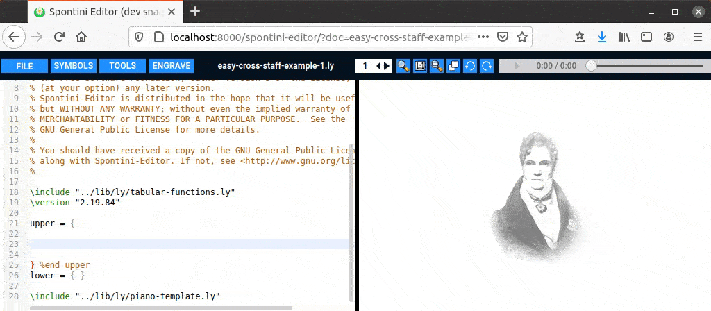
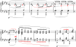
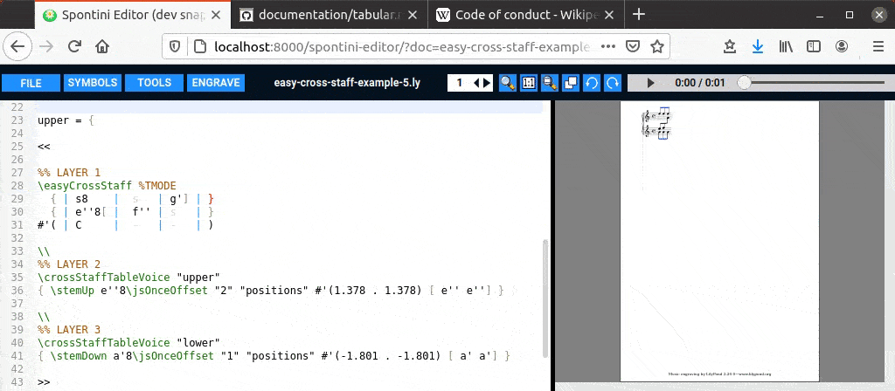

<!--
Created (20/11/2020) by Paolo-Prete.
This file is part of Spontini-Editor project.

Spontini-Editor is free software: you can redistribute it and/or modify
it under the terms of the GNU General Public License as published by
the Free Software Foundation, either version 3 of the License, or
(at your option) any later version.
Spontini-Editor is distributed in the hope that it will be useful,
but WITHOUT ANY WARRANTY; without even the implied warranty of
MERCHANTABILITY or FITNESS FOR A PARTICULAR PURPOSE.  See the
GNU General Public License for more details.

You should have received a copy of the GNU General Public License
along with Spontini-Editor. If not, see <http://www.gnu.org/licenses/>.
-->

# Tabular piano functions
<br></br>



<br></br>
### 1) Basic how-to

The **\easyCrossStaff**, and **\tabularTwoStavesPoly[...]** functions are particularly useful for creating piano scores, or any score for instruments with two staves; they allow you to insert the notes of both staves of the instrument into a table that is automatically formatted during insertion.

By pressing **Ctrl-2** keys, followed by **Ctrl-3**, the following object will be inserted in the text editor, which defines the above table:

```
\easyCrossStaff %TMODE
  { | s | }
  { | s | }
#'( | - | )
```

The **|** marker separates the columns of the table. This is a special marker visible only with Spontini-Editor: if you open the ly document with any other editor, you will see (and you have to use) the "\CS" expression instead of it. Now move the cursor on the first row of the table and press **Ctrl-3** keys to add a column. Inside the table, the block-selection mode is automatically activated and it helps the user in selecting objects of the table according to its formatting; this helps too, for example, in deleting a column by simply selecting it with the mouse.

The first row of the table defines the notes of the upper staff, the second row the notes of the lower staff. The last line defines the position of the cross-staff beams:

  * The 'U' character places the cross-staff beams at the top
  * The 'D' character places the cross-staff beams at the bottom
  * The 'C' character places the cross-staff beams between the staves
  * The 'N' character disables cross-staff
  * The '-' character maintains the behavior of the previous character

Look at **[THIS](../examples/easy-cross-staff-example-1.ly)** and **[THIS](../examples/easy-cross-staff-example-2.ly)** example to understand better

**IMPORTANT!** in order to use EasyCrossStaff, not only must the tabular-functions.ly file be included; the following piano template must also be used, and the tables must be inserted in the upper staff:

```
\include "path/to/lib/ly/jssvg.ly"
\include "path/to/lib/ly/tabular-functions.ly"

upper = {
   % insert cross-staff tables here!
}

lower = { }

\include "path/to/lib/ly/piano-template.ly"
```

*NOTE*: if you want to avoid automatic formatting, remove the string "%TMODE"

<br></br>
### 2) Writing complex and polyphonic piano scores

With Spontini-Editor it is possible to write complex scores for piano, combining polyphony and cross-staff, which is very common in music from (at least) the end of XIX century onwards.
Here we examine a fragment of a prelude to Debussy ("Danseuses de Delphes"), which can be downloaded from the **[IMSLP](https://imslp.org/wiki/Pr%C3%A9ludes%2C_Livre_1_(Debussy%2C_Claude))** website.

<p align="center">
  
</p>

Spontini-Editor allows you to combine voices in polyphony with the cross-staff layer by providing a multi-layered template. Let's see how it works practically.

In Debussy's prelude we can generally identify, in addition to a cross-staff layer, a polyphony layer on the lower staff and another layer on the upper staff.
For example, in the bar that follows, we identify the cross-staff layer with blue color, with red the additional voice on the upper staff and with green the additional voice on the lower staff.


We can make the above bar with the following template:

```
<<

%% LAYER 1
\easyCrossStaff #blue %TMODE
  { ...                            ... }
  { ... add cross staff notes here ... }
#'( ...                            ... )

\\
%% LAYER 2
\crossStaffTableVoice #red "upper"
{ ... add upper staff notes here ... }

\\
%% LAYER 3
\crossStaffTableVoice #green "lower"
{ ... add lower staff notes here ... }

>>
```

*(The color parameter in \crossStaffTableVoice and \easyCrossStaff is optional and can be omitted. also look at **[THIS](../examples/easy-cross-staff-example-4.ly)** example in order to see how layers can be basically combined).*

The first six bars of Debussy's prelude were made with the multi-layer template (check **[THIS](../examples/easy-cross-staff-example-7.ly)** example). As you can see, given the complexity of the score, it was necessary to make further tuning of **many** graphic objects (curves, beams, dots, dynamics and accidentals: 19 objects to be adjusted are shown with red color in the below picture):

<p align="center">
  
</p>

All this tuning has been made using the mouse with the **\jsTweak**, **\jsOnceOffset** and **\jsShape** functions, as you can see with the editor by opening the **[discussed example](../examples/easy-cross-staff-example-7.ly)**.
Here's the improved result (note that some issues of the historical engraving are fixed as well):

<p align="center">
  
</p>

Let's now consider another case: when the notes of the two staves are in polyphony, but without cross-staff.
In this case, you can use the functions **\tabularTwoStavesPolyI/II/III/IV**. 
These functions are automatically generated by pressing the **"Ctrl-1"** keys, adding the letter "I" (or "II" or "III" or "IV") to the string \tabularTwoStavesPoly, placing the cursor on the next line and pressing the keys **"Ctrl-3"**. For example, in the case of \tabularTwoStavesPolyII the following expression will be generated:
    
```
\tabularTwoStavesPolyII %TMODE
  { | }
  { | }% _
  { | }%
  { | }
```

All the rows in this table are automatically formatted by the editor, as it happens with the rows of the \easyCrossStaff table. By pressing **"Ctrl-3"**, after placing the cursor on the first row of the table, you can add a new column as well. Look at **[THIS](../examples/tabular-poly-example.ly)** example to better understand.

<br></br>
### 3) Coding rules and __JSSVG__/__VARS__ blocks

When writing scores with the tabular functions, it is **strongly** advised to apply the following rules, in order to make the ly document easy to 
read and to modify:

  1. Write exactly ONE measure for each \easyCrossStaff (multi-layered) block. This will help in not having long lines in the ly document.
  2. Make the lines even shorter by adding a block for variables/functions (__JSSVG__/__VARS__ blocks)

A __JSSVG__ block can be inserted with **Ctrl-8** keys (or with **TOOLS ---> Add __JSSVG__ block**; for a __VARS__ block use **Ctrl-8** keys or **TOOLS ---> Add __VARS__ block**), which will create, at the cursor position, the following expression:

```
%-----------------%
% START __JSSVG__ %
%-----------------%

... jssvg function 1 ...
... jssvg function 2 ...
.
.
.
... jssvg function N ...

%-----------------%
% END __JSSVG__   %
%-----------------%

```

This block allows you to automatically create and insert layout variables for all the \jsXXX items, so to prevent lines from becoming too long horizontally and so to have a clearer view of the score from the text. 


To create a layout variable, select the a "\jsXXX" part of the text of a cross-staff table and choose **TOOLS ---> Mark with variable/function** (or press **"Ctrl-5"** keys), while keeping the previous text selected: a layout variable will be automatically inserted in the previous block, replacing the selected text with a short symbol, and it will therefore shorten the associated line.
(Look at the video below and play with it yourself with **[THIS](../examples/easy-cross-staff-example-5.ly)** example).
<br></br><br></br>


<br></br>
### 4) Piano scores with more than two staves

Look at **[THIS](../examples/easy-cross-staff-example-8.ly)** and **[THIS (Sorabji fragment)](../examples/easy-cross-staff-example-9.ly)** examples.


### [TABLE OF CONTENTS](toc.md)
