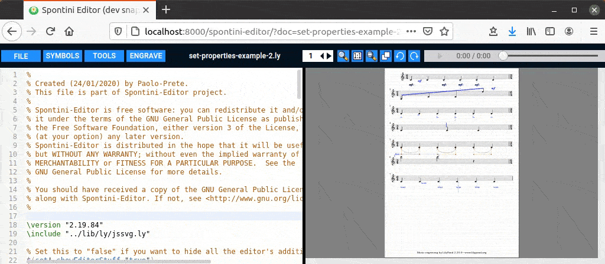

<!--
Created (20/11/2020) by Paolo-Prete.
This file is part of Spontini-Editor project.

Spontini-Editor is free software: you can redistribute it and/or modify
it under the terms of the GNU General Public License as published by
the Free Software Foundation, either version 3 of the License, or
(at your option) any later version.
Spontini-Editor is distributed in the hope that it will be useful,
but WITHOUT ANY WARRANTY; without even the implied warranty of
MERCHANTABILITY or FITNESS FOR A PARTICULAR PURPOSE.  See the
GNU General Public License for more details.

You should have received a copy of the GNU General Public License
along with Spontini-Editor. If not, see <http://www.gnu.org/licenses/>.
-->

# Tweaking/Overriding music properties
<br></br>



<br></br>

Spontini-Editor maps LilyPond's **\once \override** and **\tweak** commands, used on object positioning properties (**extra-offset**, **Y-offset** etc.), with two respective commands: **\jsOnceOverride** and **\jsTweak**. The result of these commands can be modified using the mouse, acting on the generated SVG drawing, in order to avoid LilyPond's standard trial-and-error process.

For example, if we want to modify the extra-offset of a dynamic, the standard LilyPond code will be:

```
{
    % LilyPond standard
    %
    % Tweak
    c' c' \tweak extra-offset #'(0.71 . -3.539) \mf c' c'
    % Override
    c' \once \override DynamicText.extra-offset = #'(1.806 . -2.388) c'\mf c' c'
}
```
The above code, translated into the respective Spontini-Editor commands, becomes:

```
\include "path/to/lib/ly/jssvg.ly"

{
    % Spontini-Editor's map
    %
    % Tweak
    c' c' \jsTweak "ID1" "extra-offset" #'(0.71 . -3.539) \mf c' c'
    % Override
    c' \jsOnceOverride "ID2" "extra-offset" #'(1.806 . -2.388) DynamicText c'\mf c' c'
}
```

Where "ID1/2" are unique numbers associated with each of the properties to be modified. The **\jsTweak** and **\jsOnceOverride** commands (and, consequently, the unique IDs) can be automatically generated in three ways:

 1. By clicking on the corresponding dynamic in the right display panel of the score with the right mouse button; a drop-down menu will open: it allows you to choose the property to be modified.

 2. By pressing **Ctrl-F1** (\jsTweak) and **Ctrl-F2** (\jsOnceOverride) keys. A string in the form **\jsTweak(Override) "ID" " " # '()** will be generated by the editor; in this string, the property to be modified must be entered manually.
 
 3. By Choosing \jsTweak or \jsOnceOverride in the TOOLS menu (same as 2. )

Once the Spontini-Editor commands have been created, and after compiling the file, the corresponding objects will be highlighted by the editor and you can edit them with the mouse if the edited score is currently in SVG mode.
You can set "svg" or "pdf" as the default mode of the editor with "Set configuration parameter" tool (from the TOOLS menu): just enter "default-mode" as the parameter to configure and (lowercase) "pdf" or "svg" as the value for it.
You can also switch on the fly, for the currently edited score, from PDF to SVG and vice-versa (FILE ---> SVG/PDF mode) and your last choice will be saved and remembered by the editor when you re-open the file.
It is suggested to edit your score in PDF mode, because it is much faster to engrave than SVG; then you can do all the jsTweaks with the mouse, in SVG mode, at the last stage of your work, so to save time.
Note too that all the jsTweaks made in SVG mode will appear in the generated PDF too (but they can't be edited on the fly with the mouse on the PDF document).

Try **[THIS](../examples/set-properties-example-1.ly)** and **[THIS](../examples/set-properties-example-2.ly)** example to better understand.

*NOTE 1*: For **beams** and **curves** (Slur, PhrasingSlur and Tie) the respective commands to be used are **\jsOnceOffset** and **\jsShape**, available in the drop-down menu, which map respectively **\once \offset** and **\shape** commands. Refer to **[THIS](../examples/set-properties-example-2.ly)** so to see how they must be set

*NOTE 2*: For a (non-exhaustive) list of the properties supported by Spontini-Editor for the various objects, refer to **[THIS](../examples/set-properties-example-2.ly)** and **[THIS](../examples/padding-on-brackets-example.ly)** examples (being updated).

### [TABLE OF CONTENTS](toc.md)
